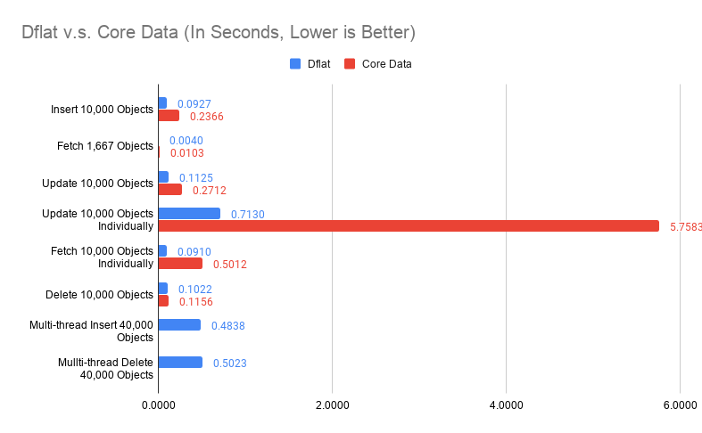
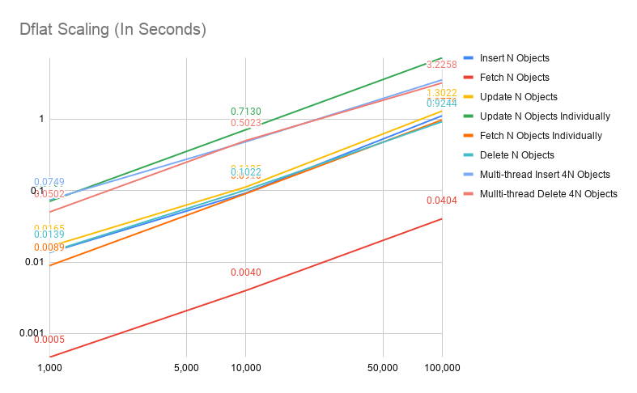

# Benchmark

Benchmark on structured data persistence system is notoriously hard. **Dflat** won't claim to be fastest. However, it strives to be *predictable performant*. What that means is there shouldn't be any pathological cases that the performance of **Dflat** degrades unexpectedly. It also means **Dflat** won't be surprisingly fast for some optimal cases.

Following data are collected, and can be reproduced from:

```
./focus.py app:Benchmarks
```

I compared mainly against Core Data, and listed numbers for FMDB and [WCDB](https://github.com/Tencent/wcdb) from WCDB Benchmark (from v1.0.8.2) to give a better overview of what you would expect from the test device.

The test device is a iPhone 11 Pro with 64GB memory.

**A Disclaimer**: you should take a grain of salt for any benchmark numbers. These numbers I presented here simply to demonstrate some pathological cases for frameworks involved. It shouldn't be taken out of this context. In practice, structured data persistence systems rarely are the bottle-neck. It is more important to understand how you use it rather than what's the raw numbers in a light-workload device looks like.

The code for `app:Benchmarks` was compiled in Release mode (`--compilation-mode=opt`) with `-whole-module-optimization` on. The WCDB Benchmark was compiled in Release mode whatever that means in their project file.

The benchmark itself is preliminary. It represents the best case scenarios for these frameworks, and I'd like to update this benchmark later with more focus on update propagation.

First, we compared **Dflat** against Core Data on object insertions, fetching, updates and deletions. 10,000 objects are generated, with no index (only title indexed in Core Data).

*Fetching 1,667 Objects* evaluated both frameworks on querying by non-indexed property.

*Update 10,000 Objects Individually* evaluated updating different objects in separate transactions 10,000 times.

*Fetching 10,000 Objects Individually* evaluated fetching different objects by title (indexed in Core Data and is the primary key in Dflat) 10,000 times.

These are obviously not the best way of doing things (you should update objects in one big transaction, and fetch them in batch if possible), but these are the interesting pathological cases we discussed earlier.

A proper way of doing multi-thread insertions / deletions in Core Data are considerably more tricky, I haven't got around to do that. The *Multi-thread Insert 40,000 Objects* and *Multi-thread Delete 40,000 Objects* are only for **Dflat**.



Some of these numbers looks too good to be true. For example, on insertions, **Dflat** appears 20 times faster than Core Data. Some of these numbers didn't make intuitive sense, why multi-thread insertions are slower? Putting it in perspective is important.


The chart compared against numbers extracted from WCDB Benchmark (v1.0.8.2) without any modifications. It compares ops per seconds rather than time spent fetching 3,334 objects. Note that in WCDB Benchmark, Baseline Read did fetch all, which is the best case scenario in SQLite. It also compares a simple table with only two columns, a key and a blob payload (100 bytes).

Multi-thread writes is indeed slower in our ideal case, because SQLite itself cannot execute writes concurrently. Thus, our multi-writer mode really just means these transaction closures can be executed concurrently. The writes still happen serially at SQLite layer. It is still beneficial because in real-world cases, we spend significant time in the transaction closure for data transformations, rather than SQLite writes.

The ceiling for writes is higher than what **Dflat** achieved. Again, WCDB represents an ideal case where you have only two columns. **Dflat** numbers in real-world would also be lower than what we had here, because we will have more indexes and objects with many fields, even arrays of data.

Since **Dflat** doesn't introduce any optimizations for batch operations, it shouldn't be a surprise that **Dflat** performance scales linearly w.r.t. dataset size, as the follow chart will show.


