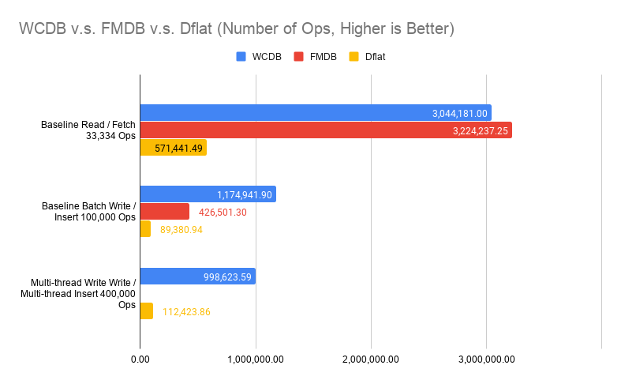

# Benchmark

Benchmark on structured data persistence system is notoriously hard. **Dflat** won't claim to be fastest. However, it strives to be *predictable performant*. What that means is there shouldn't be any pathological cases that the performance of **Dflat** degrades unexpectedly. It also means **Dflat** won't be surprisingly fast for some optimal cases.

Following data are collected, and can be reproduced from:

```
./focus.py app:Benchmarks
```

I compared mainly against Core Data, and listed numbers for FMDB and [WCDB](https://github.com/Tencent/wcdb) from WCDB Benchmark (from v1.0.8.2) to give a better overview of what you would expect from the test device.

The test device is a iPhone 11 Pro with 64GB memory.

**A Disclaimer**: you should take a grain of salt for any benchmark numbers. These numbers I presented here simply to demonstrate some pathological cases for frameworks involved. It shouldn't be taken out of this context. In practice, structured data persistence systems rarely are the bottle-neck. It is more important to understand how you use it rather than what's the raw numbers in a light-workload device looks like.

The code for `app:Benchmarks` was compiled in Release mode (`--compilation-mode=opt`) with `-whole-module-optimization` on. The WCDB Benchmark was compiled in Release mode whatever that means in their project file.

The benchmark itself is not peer-reviewed. In some cases, it represents the best case scenarios for these frameworks. In other cases, it represents the worst case scenarios. It is not designed to reflect real-world work-load. Rather, these benchmarks designed to reflect the framework's characteristics under extreme cases.

## CRUD

First, we compared **Dflat** against Core Data on object insertions, fetching, updates and deletions. 10,000 objects are generated, with no index (only title indexed in Core Data).

*Fetching 1,667 Objects* evaluated both frameworks on querying by non-indexed property.

*Update 10,000 Objects Individually* evaluated updating different objects in separate transactions 10,000 times.

*Fetching 10,000 Objects Individually* evaluated fetching different objects by title (indexed in Core Data and is the primary key in Dflat) 10,000 times.

These are obviously not the best way of doing things (you should update objects in one big transaction, and fetch them in batch if possible), but these are the interesting pathological cases we discussed earlier.

A proper way of doing multi-thread insertions / deletions in Core Data are considerably more tricky, I haven't got around to do that. The *Multi-thread Insert 40,000 Objects* and *Multi-thread Delete 40,000 Objects* are only for **Dflat**.


Some of these numbers looks too good to be true. For example, on insertions, **Dflat** appears more than twice as fast as Core Data. Some of these numbers didn't make intuitive sense, why multi-thread insertions are slower? Putting it in perspective is important.



The chart compared against numbers extracted from WCDB Benchmark (v1.0.8.2) without any modifications. It compares ops per seconds rather than time spent fetching 33,334 objects. Note that in WCDB Benchmark, Baseline Read did fetch all, which is the best case scenario in SQLite. It also compares a simple table with only two columns, a key and a blob payload (100 bytes).

Multi-thread writes is indeed slower in our ideal case, because SQLite itself cannot execute writes concurrently. Thus, our multi-writer mode really just means these transaction closures can be executed concurrently. The writes still happen serially at SQLite layer. It is still beneficial because in real-world cases, we spend significant time in the transaction closure for data transformations, rather than SQLite writes.

The ceiling for writes is much higher than what **Dflat** achieved. Again, WCDB represents an ideal case where you have only two columns. **Dflat** numbers in real-world would also be lower than what we had here, because we will have more indexes and objects with many fields, even arrays of data.

Since **Dflat** doesn't introduce any optimizations for batch operations, it shouldn't be a surprise that **Dflat** performance scales linearly w.r.t. dataset size, as the follow chart will show.


## Change Subscription

Every framework has slightly different design for how changes subscription works. Core Data implements this in two ways: `NSFetchedResultsController` delegate callbacks, and `NSManagedObjectContextObjectsDidChange`. From developer's perspective, `NSFetchedResultsController` can be interpreted as counter-part for `FetchedResult` subscription on **Dflat** side. Both supports making SQL-like queries and sending updates for the result set. You can build the **Dflat** object subscription mechanism in Core Data based on `NSManagedObjectContextObjectsDidChange` notification. For the purpose of being objective, I will simply observe the latency for `NSManagedObjectContextObjectsDidChange` notification when compare these two, assuming the underlying delivery to individual object subscription is a no-op.

There are three parts of the benchmark:

 1. Subscribe changes to 1,000 fetched results, each observe exactly one object (fetched by the primary key). Subsequent transaction will update 10,000 objects, including these subscribed 1,000 objects. Measuring the latency from when saved, to the time when updates delivered. For Core Data, a child context of viewContext was set up, and the latency was measured before saving the child context, to the time it is delivered. This should be before data persisted (`viewContext.save()` was called after child context saved). On **Dflat** side, this happens after data persisted.

 2. Subscribe changes to 1,000 fetched objects. Subsequent transaction will update 10,000 objects, including these subscribed 1,000 objects. Measuring the latency from when saved, to the time when updates delivered. For Core Data, `NSManagedObjectContextObjectsDidChange` was subscribed for the `viewContext` object. It measures the latency from before saving the child context, to the time notification was delivered.

 3. Subscribe changes to 1,000 fetched results, each observe around 1,000 objects (fetched by a range query). Subsequent transaction will update 10,000 objects, rotate all objects in each fetched results, while maintaining 1,000 objects per result. The measurement setup on Core Data is the same as 1.


The number for both fetched results observation, especially on case 1, represents the most pathological case of them all. It is particularly troublesome for **Dflat** because fetching 1,000 objects from disk individually would take around 20 milliseconds. Thus, if we would take [SQLite.swift](https://github.com/stephencelis/SQLite.swift) approach of *identifying whcih table changed and simply refetch every query on that table*, we could end up more performant. Although for case 3, refetching from disk would definitely be slower (close to 6 seconds for 1,000 queries, each with 1,000 objects).

From the benchmark, Core Data suffered similar problem, while being worse. Again, this is a extreme case. For mobile apps, you should only have handful of query subscriptions, with probably at most thousands of objects for each query, and unsubscribe changes as you navigate away to other pages. These extreme cases hardly realistic, you are not going to see 35-second stutter from Core Data just because there are 10,000 objects updated and you happen to have 1,000 table views need to be updated. In reality, subscribe to individual queries by primary key seems to be a big no-no. If you want to observe individual object, you should just subscribe individual object as case 2 shows.

However, it does expose that our message-sorting-and-delivery mechanism not working as efficiently as we expected. Fundamentally, **Dflat**'s change subscription works best with incremental changes, because we evaluate every changed objects against all fetched request subscriptions related to that object. This design avoids trip to the disk on every transaction, but also relies on a reasonable implementation to evaluate every changed objects efficiently.

A quick test shows that looping over 10,000 objects with 1,000 string equality evaluation in Swift takes about 30 milliseconds. Profile shows majority time was spent on objects retain / release and function calls for Swift runtime. There are two ways to improve:

 1. Current evaluation relies on Swift protocol with associated types. It seems certain Swift usage has higher runtime cost than others. Switching to a better linear scan, either with a interpreted VM or simply optimizing the evaluation procedure, would probably show 5 to 10x improvements.

 2. Algorithmically, it can be improved. Current implementation is naive in a way that we evaluate each object against each subscribed query. From the study of database implementation, we know accelerated data structures can be be helpful. Particularly, each `FieldExpr` in a query can be used to build a sorted set, `Comparable` queries can be accelerated with these sorted sets.

Both are quite doable, while each has its own challenges. For 1, we need to wrestling with Swift runtime, and its behavior can be erratic at times for obvious gains to be possible. Because I am not intended to delegate parts to C, it makes all harder. For 2, while it is not hard to implement, we use 3-value logic internally (to support `isNull` / `isNotNull` queries), that means for every turn, we need to sort with `UNKNOWN`. Having a robust and correct such implementation means to have much more unit tests to feel comfortable. We also need to balance when to linear scan and when to use accelerated data structures because for small number of changes, linear scan could be faster from previous empirical studies.

### Key-Value Container, WorkspaceDictionary

New data collected to compare **Dflat**'s `WorkspaceDictionay` against `UserDefaults` as a convenient persisted key-value container on iOS. As a reminder, raw performance rarely is a consideration for persisted key-value containers on mobile apps. The data provided here are helpful for us to understand the characteristics in designing **Dflat**'s `WorkspaceDictionary`.

The new data were collected from a iPhone 13 Pro with 128GiB storage. Compilation parameters were the same as the other benchmarks.


`UserDefaults` doesn't differentiate `synchronize()` or not with more recent iOS releases. `WorkspaceDictionary` implementation still makes such differentiation. Thus, there is a delta between inserting and persisted to disk in `WorkspaceDictionary` case. On the other hand, `UserDefaults` imposes 4MiB limits on the plist file, thus, benchmarks are done with limit number of keys (total of 80,001 keys).

As the file grow larger, `UserDefaults` takes longer to persist. This is not surprising. `UserDefaults`'s persistence mechanism is to simply save all data into one plist file every time. **Dflat**'s `WorkspaceDictionary` uses SQLite as the backing store, thus, inserting another 40,000 keys takes the same time as the first 40,000.

It should come no surprise that both `UserDefaults` and `WorkspaceDictionary` are pretty fast when accessing "hot" keys. Both implementations have a in-memory component that can avoid a trip to disk when requesting a key previously accessed.

When keys are "cold", there is a performance gap between `UserDefaults` and `WorkspaceDictionary` (0.0641s v.s. 0.205s). It is because for `UserDefaults`, all key-values are loaded at once, while for `WorkspaceDictionary`, key-values are loaded on-demand. This is also why there is no meaningful performance difference between *Read 400 Int 100 Times, Cold* and *Read 40,000 Int, Hot*. The cold load of 400 items are amortized over the later 99 accesses. Not doing any batch loading is intentional for `WorkspaceDictionary`. The performance characteristics is more predictable, there is no size limit, and it is simpler overall. I implemented batching on startup type of tricks before. While it worked in production, that performance win is only validated with hundreds of millions users during A/B test. It is hard to implement effectively without.

Unlike `UserDefaults` which only supports plist values, **Dflat**'s `WorkspaceDictionary` supports both `Codable` objects, and the newly introduced `FlatBuffersCodable` objects. The performance wins of `FlatBuffersCodable` is validated in the benchmark. On saving, `FlatBufersCodable` is about 2 to 3 times faster while on loading, `FlatBuffersCodable` is about 50% faster. The encoding performance is noticeable because when set, `WorkspaceDictionary` does encoding synchronously. This is a practical choice because the `Codable` object may not be thread-safe. On the other hand, `FlatBuffersCodable` objects are generated and trivially thread-safe.

Since `WorkspaceDictionary` is effectively a thread-safe dictionary, there is a trivial improvement we can do by sharding the dictionary to avoid lock-contention. This turns out to be beneficial.


Comparing no shard (using a lock to protect the in-memory dictionary) with 12-way shards (by key hash value, only lock one of the 12 dictionaries), in simpler cases such as insert integers, fewer lock-contention is beneficial. When there is a lock-contention, such as *Update 1 Key with 40,000 Int*, as expected, the difference is minimal.

There is a bigger difference with `Codable`, it is unfortunate. When set, we only release lock when the object is encoded. There is a complex reason for that (we only update when compared old value with the new, and the old value is fetched with the lock. Thus, our current sequence is: update in-memory dictionary with new value and get old value -> if old value != new value -> encode object -> dispatch to persist in background thread. We need to protect the whole in-memory dictionary update til dispatch to persist, otherwise we may end up with in-memory dictionary of one value but on disk, it is another. Alternative is to move the encode object part before updating in-memory dictionary. That missed the opportunity to skip the encoding entirely if old == new). The difference you saw is when we can do encoding in parallel v.s. we have to serialize it.

The above comparison raises question about when to use `WorkspaceDictionary`. The answer is not easy. If you are using **Dflat** already, `WorkspaceDictionary` is an easy way to persist some one off data with the same guarantee **Dflat** has, you don't need to deal with OS differences with `UserDefaults`, or worry about the size limitations. It will be more beneficial with **Dflat** when I introduce transactional guarantee later this year.
